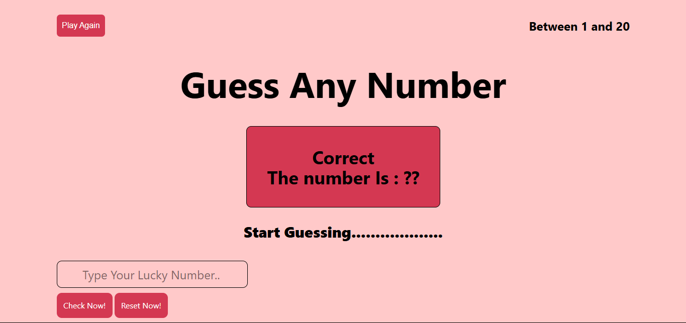

# 🎯 Guessing Game (HTML + Tailwind CSS + JavaScript)

A fun, interactive number guessing game built with **HTML**, **Tailwind CSS**, and **Vanilla JavaScript**. The user tries to guess a randomly generated number between **1 and 20**. Feedback is provided after each guess, and the game ends after 10 incorrect attempts.

---

## 🌐 Live Preview

▶️ **[Play the Game Here](https://farhanahmedanik59.github.io/Guessing-Game/)**

---

## 📸 Screenshot

*(Add a screenshot here if available)*  

---

## 🚀 How to Play

1. Enter a number between **1 and 20** in the input field.
2. Click the **"Check Now!"** button.
3. You'll receive hints:
   - 🎉 Correct guess
 
4. You have **10 chances** to guess the number.
5. After success or failure, the game automatically resets after 5 seconds or you can manually use the **Reset** buttons.

---

## 🧩 Features

- Random number generation between 1–20
- Max 10 attempts per game
- Real-time feedback for guesses
- Play Again and Reset buttons
- Responsive UI with **Tailwind CSS**
- Simple and clean user interface

---

## 🛠️ Tech Stack

- **HTML5**
- **Tailwind CSS**
- **JavaScript (Vanilla)**

---

## 📁 Project Structure
Guessing-Game/
 
├── index.html # Main game interface
 
├── script/
 
│ └── script.js # Game logic and interactivity
 
├── style/
 
│ ├── style.css # Custom styles (optional)
 
│ └── tailwind.css # Tailwind framework
 
└── README.md # Project documentation
